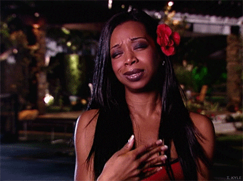
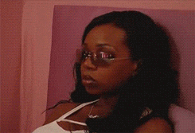
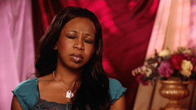
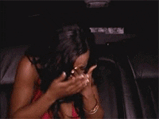
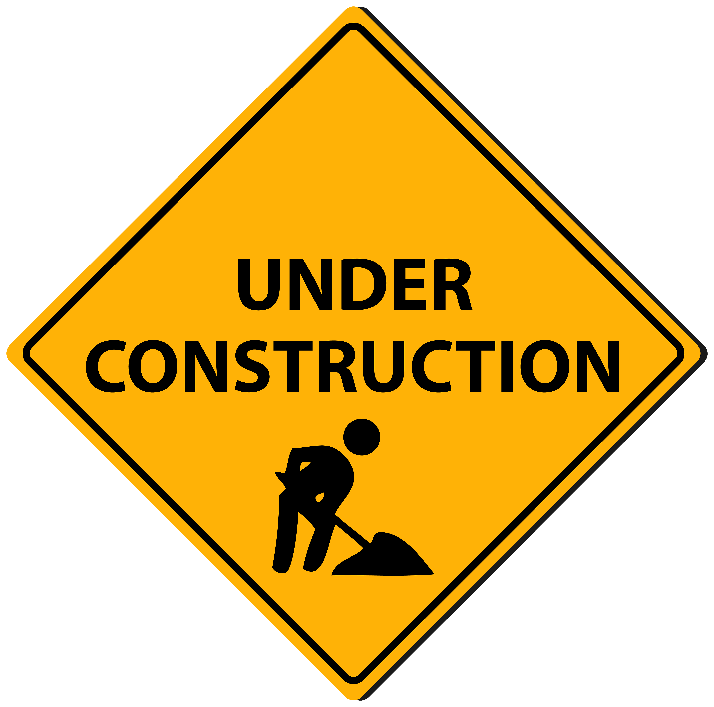

# Project2Employment (P2E)
**Bridging the gap between "*knowing*" and "*doing*"**

> This repository serves as a live log of projects I am building while waiting for the recruitment void to finally swallow my resume and spit out an offer.

## The Goal:
*To prevent technical stagnation and fight skill decay. This will involve:*

> - Building projects to reinforce the fundamentals, sharpen my existing toolkit, and force-feed myself new concepts through implementation. 
> - Documenting my journey of turning "I think I know how to do that" into "I have built that"

I'm working to transform abstract knowledge into concrete, working software. And having something to show for it.

## Repository Structure:
Each directory represents a distinct project attempt

### Code
The implementation and source files.

&emsp;&emsp;&emsp;  

### Documentation
The project breakdown, including:
> - Learning goals
> - Tech stack involved
> - Rationale behind decisions
> - Hurdles I hit
> - Lessons learned

### Project Vibe Check
Upon completing each project, I will categorize my mental state during the building process as one of the following:

 

1. Too Easy: 
> ***Light Work, No Reaction.*** I could code this in my sleep.

 

2. Zoned Out:
> ***Disengaged***. I was bored. Definitely went through the motions just to complete it—because I'm no quitter :eyes:

 

3. Confused: 
> ***High-friction learning.***  I hit walls. I had to read documentation, watch tutorials, and rethink my architecture

4. Devastated: 
> ***Total breakdown.*** The code won, and I lost my sanity. Definitely put in my fry cook application for the Krusty Krab

---

## Table of Projects

To be populated once the project gods have spoken.

*Check back later*

---

> Last updated: 09/22/25